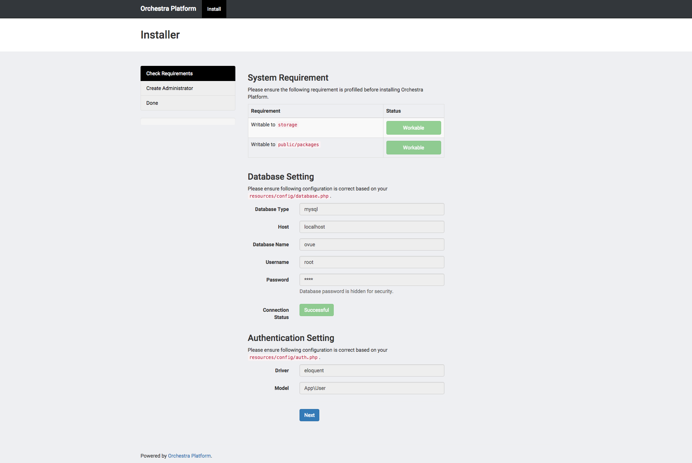

# Build an App with Orchestra Platform 3

## Table of Content

* [Install Orchestra Platform & Create New Project](#install-orchestra-platform--create-new-project)
    - [Install Lumen](#install-lumen)
* Setup DB, Create Migration & Insert Dummy Data

## Install Orchestra Platform & Create New Project

First Install Composer By Following [this guide](https://getcomposer.org/doc/00-intro.md).

Then, download the Lumenate installer using Composer.

    composer global require "orchestra/lumenate=^0.1"

Once successfully installed, you can type composer create project command to create new Orchestra Platform project (we'll be using `ovue` as the project name).

    composer create-project orchestra/platform ovue 3.1.x --prefer-dist

After successfully creating the project, make sure your webserver is running (we will be using the serve command for now), now go into the project directory and type.

    php artisan serve

Now you can open the following url <http://localhost:8000>, and you will see the Laravel front page.

Now we will add a package called [Studio](https://github.com/orchestral/studio). This Orchestra Platform package provides a variety of generators to speed up your development process. You can install the package via composer as:

    composer require "orchestra/studio=~3.1" --dev

Now create a new `resources/config/local/app.php` file and include the following:

```php
<?php 

return [
    'providers' => append_config([
        Orchestra\Studio\StudioServiceProvider::class,
    ]),
];
```

Now run `php artisan`. You should see new commands added in the make:* section.

### Install Lumen

Now, you can also setup Lumen for Orchestra Platform by running the following command.

    lumenate install

Once `orchestra/lumen` is installed, you can run the following command to insert the app skeleton code (which will be added under `lumen` directory).

    lumenate make

Next, we need to update `composer.json` to include new autoload directories.

```json
    "autoload": {
        "classmap": [
            "resources/database"
        ],
        "psr-4": {
            "App\\Lumen\\": "lumen/",
            "App\\": "app/"
        }
    },
    "autoload-dev": {
        "classmap": [
            "lumen/tests/LumenTestCase.php",
            "tests/TestCase.php"
        ]
    },
```

Don't forget to run `dump-autoload` to include the new paths.

    composer dump-autoload

## Setup DB, Create Migration & Insert Dummy Data

### Setup DB

now open the `.env` file and change the following:-

```
DB_HOST=localhost
DB_DATABASE=ovue    # Your Database Name
DB_USERNAME=root    # Your Database Username
DB_PASSWORD=root    # Your Database Password
```

Now let's run `php artisan serve` and setup administrator account for this project from <http://localhost:8000/admin/install>.




